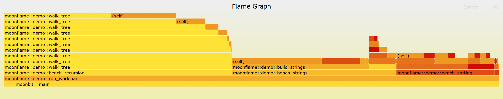
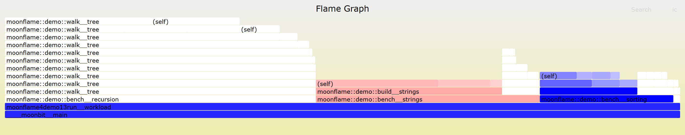

# MoonFlame

**用纯 MoonBit 把「折叠栈」性能数据渲染成一张可交互的 SVG 火焰图。**

不依赖 Go、Node 或任何运行时——产物是单个文件，双击即看，可直接贴进 README。



> 上图由 `moon run cmd/main -- testdata/demo.folded --out flame.svg` 生成，输入是真实采样数据。
> 想体验**点击缩放、Ctrl-F 搜索**等交互，请下载 [`examples/flame.svg`](examples/flame.svg) 用浏览器打开
> （内嵌脚本在 `` 引用下不会执行，原因见[已知限制](#已知限制)）。

---

## 目录

- [这是什么](#这是什么)
- [主要功能](#主要功能)
- [快速验证](#快速验证)
- [完整流程](#完整流程)
- [命令行](#命令行)
- [差异火焰图](#差异火焰图)
- [已知限制](#已知限制)
- [目录结构](#目录结构)
- [开发](#开发)
- [参考与许可](#参考与许可)

---

## 这是什么

一个**渲染器**。输入折叠栈（folded stack）文本，输出一张能直接看的 SVG。

```
折叠栈文本  ──▶  MoonFlame  ──▶  单个 SVG 文件
```

折叠栈是 Brendan Gregg 定义的一种通用中间格式，每行一个调用栈加它的耗时：

```text
____moonbit__main;moonflame::demo::bench__sorting;bubble__sort;array::Array::at 73382500
```

`perf`、`py-spy`、`async-profiler`、`moon-pprof` 等工具都能产出它。所以 MoonFlame **不绑定任何语言或平台**。

**它不做采样**——那是上游工具的职责。它只负责把这些数据变成一张人一眼能看懂的图。

现有的可视化方案（`go tool pprof`、speedscope、Firefox Profiler）都需要额外运行时或浏览器会话；
MoonFlame 补的是「**单文件、零环境、可归档**」这一空缺。

## 主要功能

| 功能 | 说明 |
| --- | --- |
| **折叠栈解析** | 容忍超深栈（实测 7254 层）、超长单行（181K 字符）、空帧名等各种真实数据里的脏形状 |
| **调用树聚合** | 同父同名合并累加；计算自身耗时与累计耗时 |
| **限深合并** | 超过 `--max-depth` 的部分合并为 `(deeper)` 合成帧，**而不是丢弃**——否则深层耗时会被错算到最后一个可见帧上 |
| **布局** | 火焰图（根在底部）/ 冰柱图两种方向；按值比例切分，父宽严格等于子宽之和 |
| **可交互 SVG** | 经典火焰图配色 + 内嵌脚本：悬停信息栏、点击缩放、`Reset Zoom`、`Ctrl-F` 正则搜索、`Ctrl-I` 大小写开关、命中占比 |
| **差异火焰图** | 对比两份剖面，**红 = 变多、蓝 = 变少、白 = 无变化** |
| **文本报告** | `hotspots` / `callers` / `callees` / `delta` 四个子命令，回答「谁最慢」「谁调用它」「它调用谁」「这次改动让什么变慢了」 |
| **确定性输出** | 同一输入必得逐字节相同的 SVG，可做快照测试与版本间对比 |
| **零依赖核心库** | 根包纯计算、无任何外部依赖；文件 IO 只出现在命令行入口 |

配色与交互行为对齐经典实现 `flamegraph.pl`，但对齐的只是**功能规格**——
其源码采用 CDDL-1.0（文件级弱 copyleft，不是宽松许可），为避免任何许可证混用问题，
其源码一行未复制。详见 [参考与许可](#参考与许可)。

## 快速验证

**只想看看效果的话，不需要安装任何采样工具**——仓库里已带一份真实采样数据：

```powershell
moon run cmd/main -- testdata/demo.folded --out flame.svg
```

然后用浏览器打开 `flame.svg`。想看文本热点、不出图：

```powershell
moon run cmd/main -- hotspots testdata/demo.folded --top 10
```

仓库还带了两个用例，可以直接跑：

| 文件 | 用途 |
| --- | --- |
| `testdata/demo.folded` | ⭐ 主样例：32 栈 / 深度 3–13 / 1893 ms |
| `testdata/stress-recursive.folded` | 极限用例：79 栈 / 最深 **7254 层** / 5.5 MB，用来验证限深与合并 |

## 完整流程

想拿它分析**自己的程序**，走这条四步链路。以 MoonBit 程序为例：

**① 安装采样器**（仅采集端需要，渲染器不需要）

需要 [`mizchi/moon-pprof`](https://github.com/mizchi/moon-pprof)，它依赖 Rust 工具链，安装方式见该仓库说明。

**② 把程序编译成 wasm-gc**

```powershell
moon build --target wasm-gc
```

> 必须用 wasm-gc：上游采样器基于 wasmtime，加载不了原生可执行文件。

**③ 采样并转成折叠栈**

```powershell
moon-pprof profile --wasm-gc _build/wasm-gc/debug/build/cmd/main/main.wasm --iterations 3 --out app.pb.gz
moon-pprof pprof2folded app.pb.gz app.folded
```

**④ 出图**

```powershell
moon run cmd/main -- app.folded --out flame.svg
```

`demo/` 目录里有一个可直接照抄的完整例子（四点负载 + 一键脚本）：

```powershell
powershell demo/reproduce.ps1     # 编译 → 采样 → 转折叠栈 → 打印热点
```

> 采样有随机性：重跑会得到不同的栈数与总耗时（实测行数 32–36、总耗时 1887–1917 ms），但**热点排序稳定**。
> 折叠栈里**一行 = 一个不同的调用栈**，重复出现的栈会被合并、权重累加，所以文件 32 行而原始样本有 490 个。

## 命令行

**默认命令只负责出一张图**；一切文本报告都是子命令——这样顶层选项不会随功能增长而膨胀。

```text
moon run cmd/main -- <input> [options]                     出图（默认）
moon run cmd/main -- hotspots  <input> [--top N]           热点榜
moon run cmd/main -- callers   <input> <name>              谁调用了它
moon run cmd/main -- callees   <input> <name>              它调用了谁
moon run cmd/main -- diff      <before> <after> [-o out]   差异火焰图
moon run cmd/main -- delta     <before> <after> [--top N]  差异文本排行
moon run cmd/main -- filter    <pattern> <input> [-o out]  栈过滤
```

顶层选项（默认命令）：

| 参数 | 默认 | 说明 |
| --- | --- | --- |
| `<input>` | 必填 | 折叠栈文件 |
| `-o, --out <path>` | 标准输出 | 输出路径；不传就打到标准输出 |
| `--max-depth <n>` | `32` | 每个栈最多保留的帧数，`0` 表示不限制 |
| `--width <px>` | `1400` | 画布宽度 |
| `--unit <u>` | `ns` | 权重单位：`ns` / `us` / `ms` / `s` / `count` |
| `--inverted` | 关 | 输出冰柱方向（根在顶部）；默认是火焰图方向（根在底部） |

> **为什么需要 `--unit`？** 折叠栈的第 2 列是**不透明的权重**：`moon-pprof` 给纳秒，
> `perf` / `py-spy` 给采样计数。数值本身区分不出来（`42` 既可能是 42 纳秒也可能是 42 次采样），
> 所以由你声明。时间会按数量级自动缩放（`871808200` → `871.81 ms`），计数则加千位分隔、不带后缀。

### 文本报告

```powershell
moon run cmd/main -- hotspots testdata/demo.folded --top 5
moon run cmd/main -- callers  testdata/demo.folded walk_tree
moon run cmd/main -- callees  testdata/demo.folded build_strings
moon run cmd/main -- delta    testdata/demo-baseline.folded testdata/demo.folded
```

`callers` / `callees` **按直接调用者聚合**，而不是把每条完整调用链列一行——递归函数会产生大量
几乎相同的长链，全列出来反而看不出「到底是谁在调用它」。查询名会先做归一化再按子串匹配，
所以 `walk_tree`、`walk__tree`、`demo::walk` 都能命中。

`delta` 与差异火焰图互补：**图看结构**（哪条路径变宽了），**表看函数**（哪个函数的自身耗时变了多少）。
只在其中一侧出现的函数也会列出（另一侧记 0），因为「新增的开销」和「消失的开销」恰恰是差异分析最关心的。

`filter` 是经典的 `grep funcA input | flamegraph.pl` 用法，但省掉了管道——
输出仍是折叠栈格式，可以直接再喂给出图命令：

```powershell
moon run cmd/main -- filter build_strings testdata/demo.folded -o sub.folded
moon run cmd/main -- sub.folded --out sub.svg
```

权重要原样保留、不做归一化：过滤后的图回答的是「这个子系统内部怎么分配时间」，
而它占全局多少，靠保留原始权重才能和原图对照。

### 名称归一化

上游的符号还原并不完整，真实数据里几种形态并存。渲染层会自动归一化（**解析层始终原样保留，数据不会被改写**）：

| 数据里的样子 | 显示为 |
| --- | --- |
| `moonflame::demo::build__strings` | `build_strings` |
| `moonflame4demo13run__workload` | `moonflame::demo::run_workload` |
| `array5Array3set` | `array::Array::set` |
| `____moonbit__main` | 不变（下划线开头不做折叠） |

长度前缀的还原是**自校验**的：每段声明的长度必须与实际字符数完全吻合，否则放弃。
`sha256_finalize`、`utf16le`、`base64encode` 这类名字不会被误改。
工具提示里会附上**原名**，信息不丢失。

### 交互与配色

用浏览器直接打开生成的 SVG：

| 操作 | 效果 |
| --- | --- |
| 悬停 | 底部信息栏显示该帧的完整名字、耗时与占比 |
| 单击某帧 | 以它为根缩放展开；祖先帧变半透明，无关帧隐藏 |
| `Reset Zoom` | 复原到全图 |
| `Ctrl-F` / `Search` | 正则搜索，命中帧高亮为品红，右下角显示命中占比 |
| `Ctrl-I` / `ic` | 切换搜索是否区分大小写 |

配色沿用经典火焰图的**暖色调色板**（深红 → 橙 → 黄的单维渐变），同名帧同色，便于跨图追踪同一个函数。

## 差异火焰图

对比优化前后（或升级前后）两份剖面，把差异直接画进颜色里：

```powershell
moon run cmd/main -- diff testdata/demo-baseline.folded testdata/demo.folded -o flame-diff.svg
```



| 视觉通道 | 含义 |
| --- | --- |
| **宽度** | 按**当前**（第二个）剖面 —— 看清现在的时间花在哪 |
| 🔴 **红** | 该帧**变多了**（劣化），越红变化越大 |
| 🔵 **蓝** | 该帧**变少了**（改善） |
| ⚪ **白** | 变化可以忽略（注意不是灰色——灰字在浅色底上读不出来） |
| **悬停** | 额外显示带符号的变化量 |

颜色用全图最大的变化量做归一化——不归一化的话，只要有一处剧变，其它变化在颜色上就会全糊成一片。

> ⚠️ `testdata/demo-baseline.folded` 是**构造**的基线，仅用于演示与测试差异模式，不是真实采样。
> 构造规则只有两条，可逐行核对：**含 `bubble__sort` 的行权重 ×3**、**含 `build__strings` 的行权重 ×0.8**
> （向下取整），其余行不变。真实基线应当来自优化前的那次采样。

## 已知限制

1. **上游采样仅支持 wasm / wasm-gc** 目标，native CPU 采样不可用；
2. `moon-pprof` 需要 Rust 工具链（**仅采集端**）；**核心库零依赖**，只有命令行入口依赖官方包 `moonbitlang/x` 做文件读写；
3. 递归程序会产生极深栈（实测最深 7254 层），超过深度上限的部分合并显示为 `(deeper)`；
4. **上游采样分辨率取决于函数调用频率，而非运行时长**（实测：调用密集约 600 样本/秒，循环密集约 42 样本/秒，相差 14 倍）。因此短于约 25 ms 的函数可能采不到，且**延长运行时间不会提高统计质量**；
5. 内嵌交互脚本**只在直接打开 SVG 或内联嵌入时执行**；用 `` 引用（GitHub 渲染本 README 即是如此）时浏览器不会运行 SVG 内的脚本，只显示静态外观；
6. 帧的横轴按**耗时降序**排列（经典实现按名字字母序），这是为了让宽帧聚集在左侧、更易读的刻意选择；
7. 图中会出现 `(self)` 与 `(deeper)` 两个合成帧：前者是该函数的**自身耗时**，后者是超过深度上限被合并的更深帧。经典实现没有这两个节点，显式画出它们是为了保证「父矩形宽度 = 子矩形宽度之和」——否则图面上会出现空洞。

## 目录结构

```text
.
├── LICENSE                       MIT
├── moon.mod / moon.pkg           模块与包配置
├── pkg.generated.mbti            公开接口（由 moon info 生成，须与源码同步）
│
├── folded.mbt                    折叠栈解析
├── calltree.mbt                  调用树聚合 / 限深合并 / 差异标注
├── unit.mbt                      权重单位与格式化
├── names.mbt                     符号名归一化
├── hotspot.mbt                   Top-N 热点报告
├── report.mbt                    文本报告（调用关系 / 差异排行 / 栈过滤）
├── layout.mbt                    矩形布局（火焰图 / 冰柱）
├── svg.mbt                       SVG 渲染（经典配色 + 内嵌交互脚本）
├── *_test.mbt                    核心逻辑的测试（166 个用例）
│
├── cli/                          命令行参数解析（独立包，可脱离文件系统测试）
├── cmd/main/                     入口：读文件 → 调用核心库 → 写文件
│
├── .github/workflows/ci.yml      持续集成（三平台 × 四后端 + 端到端出图）
├── demo/                         演示负载（独立模块）
│   ├── demo.mbt                  四点负载：排序 / 字符串 / 矩阵 / 递归
│   └── reproduce.ps1             一键复现：编译 → 采样 → 转折叠栈
├── examples/                     示例图（SVG 可交互，PNG 供 README 展示）
└── testdata/                     冻结的样例数据（主样例 + 极限用例 + 上游样例）
```

**分层原则**：根包只做纯计算、零外部依赖；参数解析单独成包以便脱离文件系统测试；
文件 IO 只出现在入口包——核心逻辑因此可以在没有文件系统的环境（如 wasm）里复用。

## 开发

```bash
moon check              # 类型检查
moon test               # 全部测试（122 个）
moon info && moon fmt   # 提交前更新接口并格式化
moon run cmd/main -- --help
```

## 参考与许可

本项目为**原创项目**，未复制任何第三方源码。

- 火焰图（Flame Graph）的概念与折叠栈格式由 **Brendan Gregg** 提出；
- 渲染外观与交互行为对齐 [brendangregg/FlameGraph](https://github.com/brendangregg/FlameGraph) 的 `flamegraph.pl`：**暖色调色板的数值公式、差异配色规则、以及悬停 / 点击缩放 / Ctrl-F 搜索的交互语义**均与之兼容。
  ⚠️ 该项目采用 **CDDL-1.0**——一种**文件级弱 copyleft**，不是宽松许可（它与 GPL 明确不兼容）。
  为避免任何许可证混用问题，本项目**其源码一行未复制**，只对齐功能规格，MoonBit 与 JavaScript 实现全部原创（与经典实现的偏离项见[已知限制](#已知限制)）；
- 可选的上游数据来源：[mizchi/moon-pprof](https://github.com/mizchi/moon-pprof)（Apache-2.0），负责采样与格式归一；
- 渲染正确性以 [google/pprof](https://github.com/google/pprof)（Apache-2.0）作为交叉验证基准；
- `testdata/official-sample.wasm` 来自 moon-pprof 仓库的样例（Apache-2.0）。

本项目使用 [MIT License](LICENSE)。
