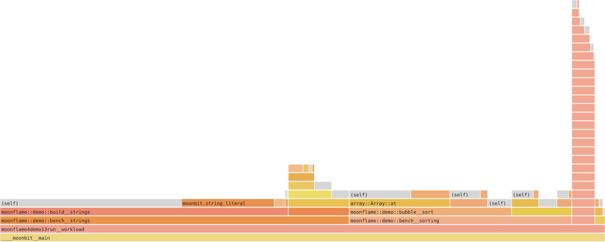
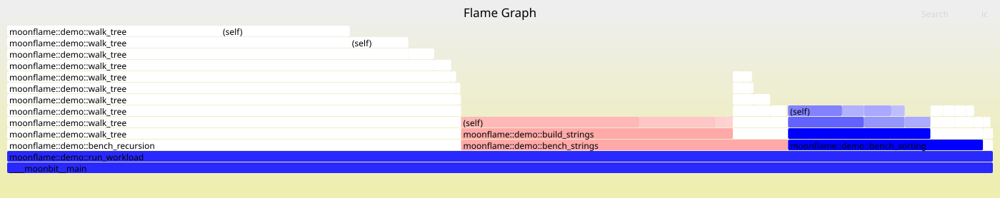

# MoonFlame

**用纯 MoonBit 把「折叠栈」性能数据渲染成一张可交互的静态 SVG 火焰图。**

不依赖 Go、Node 或任何运行时——产物是单个文件，双击即看，可直接贴进 README。



> 上图由 `moon run cmd/main -- testdata/demo.folded --out examples/flame.svg` 生成，
> 输入是 `testdata/demo.folded`（真实采样数据）。用浏览器打开可悬停查看每个帧的名字与占比。

---

## 项目状态

| 部分 | 状态 |
| --- | --- |
| 数据链路（采样 → 折叠栈） | ✅ 已跑通并交叉验证 |
| 演示负载与样例数据 | ✅ 已完成（`demo/` + `testdata/`） |
| 渲染器（解析 / 聚合 / 限深合并 / 布局 / SVG） | ✅ 可用 |
| CLI（默认渲染模式） | ✅ 可用 |
| 热点报告（`--top`） | ✅ 可用 |
| 差异火焰图（`diff` 子命令） | ✅ 可用 |
| 内嵌 JS 交互（悬停 / 缩放 / 搜索） | ✅ 可用（直接打开 SVG 时生效） |

> 与经典实现 `flamegraph.pl` 的对齐情况与仍存在的偏离，整理在 [docs/DESIGN.md](docs/DESIGN.md) §5b。

---

## 快速开始

```bash
moon run cmd/main -- testdata/demo.folded --out flame.svg
```

用浏览器打开 `flame.svg`：悬停看每个帧的名字与占比，单击可缩放，`Ctrl-F` 搜索。

> `testdata/demo.folded` 是随仓库提供的现成数据，**不需要安装任何采样工具**即可跑通。
> 这些数据是怎么来的、以及怎么处理你自己的数据，见「[数据从哪来](#数据从哪来)」。

只看文本热点、不出图：

```bash
moon run cmd/main -- testdata/demo.folded --top 10
```

示例产物见 [`examples/flame.svg`](examples/flame.svg)。

### 命令行参数

| 参数 | 说明 |
| --- | --- |
| `<input>` | 折叠栈文件（位置参数，必填） |
| `-o, --out <path>` | SVG 输出路径；不传则只打印报告 |
| `--max-depth <n>` | 每个栈最多保留的帧数，**默认 32**，`0` 表示不限制 |
| `--top <n>` | 打印前 N 个热点 |
| `--width <px>` | 画布宽度，默认 1400 |
| `--inverted` | 输出冰柱方向（根在顶部）；默认是火焰图方向（根在底部） |

### 差异火焰图

对比优化前后（或升级前后）两份剖面，把差异直接画进颜色里：

```bash
moon run cmd/main -- diff testdata/demo-baseline.folded testdata/demo.folded -o flame-diff.svg
```



| 视觉通道 | 含义 |
| --- | --- |
| **宽度** | 按**当前**（第二个）剖面 —— 看清现在的时间花在哪 |
| 🔴 **红** | 该帧**变多了**（劣化），颜色越深变化越大 |
| 🔵 **蓝** | 该帧**变少了**（改善） |
| ⚪ **灰** | 变化可以忽略 |
| **悬停** | 额外显示带符号的变化量 |

颜色用全图最大的变化量做归一化——不归一化的话，只要有一处剧变，其它变化在颜色上就会全糊成一片。

**已知取舍**：宽度按当前剖面走，因此**只在基线里出现的帧不会显示**。这与参考实现 `difffolded.pl` 一致；它的建议是交换两份文件再生成一张，从另一个方向看消失的帧。

> ⚠️ `testdata/demo-baseline.folded` 是**构造**的基线（把冒泡排序放大 3 倍、字符串拼接缩小），仅用于演示与测试差异模式，不是真实采样。真实基线应当来自优化前的那次采样。

### 交互与配色

生成的 SVG 里嵌了脚本，**用浏览器直接打开**即可交互：

| 操作 | 效果 |
| --- | --- |
| 悬停 | 底部信息栏显示该帧的完整名字、耗时与占比 |
| 单击某帧 | 以它为根缩放展开；祖先帧变半透明，无关帧隐藏 |
| 点 `Reset Zoom` | 复原到全图 |
| `Ctrl-F` 或点 `Search` | 正则搜索，命中的帧高亮为品红，右下角显示命中占比 |
| `Ctrl-I` 或点 `ic` | 切换搜索是否区分大小写 |

配色沿用经典火焰图的**暖色调色板**（深红 → 橙 → 黄的单维渐变），同名帧同色，
便于跨图追踪同一个函数。差异模式改用红/蓝：**红 = 变多**、**蓝 = 变少**、**白 = 无变化**。

> ⚠️ 用 `` 引用 SVG 时浏览器**不执行**其中的脚本——在 GitHub 上看本 README 的图只有静态外观。
> 要体验交互，请把 `examples/flame.svg` 下载后用浏览器直接打开。

### 依赖说明

**核心库零依赖**；仅命令行入口依赖官方包 [`moonbitlang/x`](https://github.com/moonbitlang/x)（Apache-2.0）做文件读写——`moonbitlang/core` 本身不含文件系统 API。

> 另一官方并发运行时 `moonbitlang/async` 在 Windows 上要求 MSVC 工具链，MinGW 环境无法构建，因此选择了 `x`。

---

## 它做什么 / 不做什么

| ✅ 做 | ❌ 不做 |
| --- | --- |
| 解析折叠栈文本 | 不做采样（那是操作系统 / moon-pprof 的职责） |
| 聚合成调用树，算自身耗时与累计耗时 | 不解析 perf.data / pprof 等二进制格式 |
| 计算布局，生成可交互的静态 SVG | 不做 Web 应用、不做拖拽缩放 |
| 文本 Top-N 热点、两份剖面差异对比 | 不依赖 Go / Node / 浏览器服务 |

**定位**：现有的可视化方案（`go tool pprof`、speedscope、Firefox Profiler）都需要额外运行时或浏览器会话；MoonFlame 补的是「单文件、零环境、可归档」这一空缺。

---

## 数据从哪来

**本项目不做采样。** MoonFlame 只接受**折叠栈（folded stack）**这一通用中间格式：

```text
____moonbit__main;moonflame::demo::bench__sorting;bubble__sort;array::Array::at 73382500
```

采样由上游工具完成，**不是我们的代码、也不是我们的依赖**——`mizchi/moon-pprof`、`perf`、`py-spy`（raw）、
`async-profiler`（collapsed）等都能产出这个格式（定义见 [FlameGraph](https://github.com/brendangregg/FlameGraph)）。

所以用起来永远是两步，分属两个工具：

| 步骤 | 谁做 | 大致命令 |
| --- | --- | --- |
| ① 采样，得到 `.folded` | **上游工具**（需自行安装） | `moon-pprof profile …` → `moon-pprof pprof2folded …` |
| ② 画图 | **MoonFlame** | `moon run cmd/main -- <任意>.folded --out flame.svg` |

第 ① 步换成任何别的工具都不影响第 ② 步——MoonFlame 只认文件，不认它的来源。

### 复现本项目使用的样例数据（可选）

`testdata/demo.folded` 是真实采样后**冻结**下来的一份，**不需要装任何工具**就能直接画图：

```powershell
moon run cmd/main -- testdata/demo.folded --out flame.svg
```

若想亲手复现这份数据的来源，`demo/` 下有一个 MoonBit 演示负载（排序 / 字符串 / 矩阵 / 递归四个阶段）
和一个 Windows 一键脚本：

```powershell
# 前置：本机已装 moon-pprof（见 docs/DATA-PIPELINE.md）。它不属于本项目。
powershell demo/reproduce.ps1     # PowerShell 7 用户可换成 pwsh
```

脚本依次：编译 `wasm-gc` → 采样 3 轮 → 转成折叠栈 → 打印热点概览，产出 `demo/demo.folded`。
它只是把这四条上游命令排好序，**不含任何测量或渲染逻辑**；删掉它不影响 MoonFlame 运行。

> 采样有随机性：重跑会得到不同的栈数与总耗时（实测行数 32–36、总耗时 1887–1917 ms），但**热点排序稳定**。
> 另外，折叠栈里**一行 = 一个不同的调用栈**，重复出现的栈会被合并、权重累加——所以文件只有 32 行，
> 而上游报告的原始样本数是 486–494。

---

## 目录结构

```text
.
├── LICENSE                       Apache-2.0
├── folded.mbt                    折叠栈解析
├── calltree.mbt                  调用树聚合 / 限深合并 / 差异标注
├── hotspot.mbt                   Top-N 热点报告
├── layout.mbt                    矩形布局（火焰图 / 冰柱两种方向）
├── svg.mbt                       SVG 渲染（暖色 / 差异配色）
├── cli/                          命令行参数解析（独立包，可脱离文件系统测试）
├── cmd/main/                     入口：读文件 → 调用核心库 → 写文件
├── docs/
│   ├── DESIGN.md                 项目设计（定位、格式、算法、已知不足）
│   ├── DATA-PIPELINE.md          数据链路验证报告（含环境踩坑与关键发现）
│   └── APPLICATION.md            项目申报书
├── demo/                         演示负载（独立模块，可复现样例数据）
│   └── reproduce.ps1             一键复现脚本
├── examples/                     CLI 生成的示例图
├── testdata/
│   ├── demo.folded               ⭐ 主样例：32 栈 / 深度 3–13 / 1893ms
│   ├── demo-baseline.folded      构造的基线，用于演示差异模式
│   ├── stress-recursive.folded   极限用例：79 栈 / 最深 7254 层
│   └── official-sample.*         上游样例（Apache-2.0）
└── tools/
    ├── analyze_folded.js         折叠栈结构分析
    └── check_topic.js            生态撞车自查（mooncakes.io）
```

**分层原则**：根包只做纯计算、零外部依赖；参数解析单独成包以便脱离文件系统测试；
文件 IO 只出现在入口包——核心逻辑因此可以在没有文件系统的环境（如 wasm）里复用。

---

## 开发

```bash
moon check          # 类型检查
moon test           # 全部测试（122 个）
moon info && moon fmt   # 提交前更新接口并格式化
moon run cmd/main -- --help
```

---

## 已知限制

1. 上游采样**仅支持 wasm / wasm-gc** 目标，native CPU 采样不可用；
2. `moon-pprof` 需要 Rust 工具链（**仅采集端**）；**核心库零依赖**，只有 CLI 依赖官方包 `moonbitlang/x` 做文件读写；
3. 递归程序会产生极深栈（实测最深 7254 层），超过深度上限的部分将被合并显示为 `(deeper)`；
4. **上游采样分辨率取决于函数调用频率，而非运行时长**（实测：调用密集约 600 样本/秒，循环密集约 42 样本/秒，相差 14 倍）。因此短于约 25ms 的函数可能采不到，且**延长运行时间不会提高统计质量**。详见 [docs/DATA-PIPELINE.md](docs/DATA-PIPELINE.md)；
5. 内嵌的交互脚本**只在直接打开 SVG 或以内联方式嵌入时执行**；用 `` 引用（GitHub 渲染本 README 即是如此）时浏览器不会运行 SVG 内的脚本，只显示静态外观；
6. 帧的横轴按**耗时降序**排列（经典实现按名字字母序），这是为了让宽帧聚集在左侧、更易读的刻意选择；
7. 图中会出现 `(self)` 与 `(deeper)` 两个合成帧：前者是该函数的**自身耗时**，后者是超过深度上限被合并的更深帧。经典实现没有这两个节点，我们显式画出它们，是为了保证「父矩形宽度 = 子矩形宽度之和」这一不变量——否则图面上会出现空洞。

---

## 参考与许可

本项目为**原创项目**，未复制任何第三方源码。

- 火焰图（Flame Graph）的概念与折叠栈格式由 **Brendan Gregg** 提出；
- 渲染外观与交互行为对齐 [brendangregg/FlameGraph](https://github.com/brendangregg/FlameGraph) 的 `flamegraph.pl`：**暖色调色板的数值公式、差异配色规则、以及悬停 / 点击缩放 / Ctrl-F 搜索的交互语义**均与之兼容。
  ⚠️ 该项目采用 **CDDL-1.0**（弱 copyleft），与本项目的 Apache-2.0 不兼容，因此**其源码一行未被复制**——只对齐功能规格，MoonBit 与 JavaScript 实现全部原创。详见 [docs/DESIGN.md](docs/DESIGN.md) §5b；
- 可选的上游数据来源：[mizchi/moon-pprof](https://github.com/mizchi/moon-pprof)（Apache-2.0），负责采样与格式归一；
- 渲染正确性以 [google/pprof](https://github.com/google/pprof)（Apache-2.0）作为交叉验证基准；
- `testdata/official-sample.wasm` 来自 moon-pprof 仓库的样例（Apache-2.0）。

本项目使用 [Apache License 2.0](LICENSE)。
